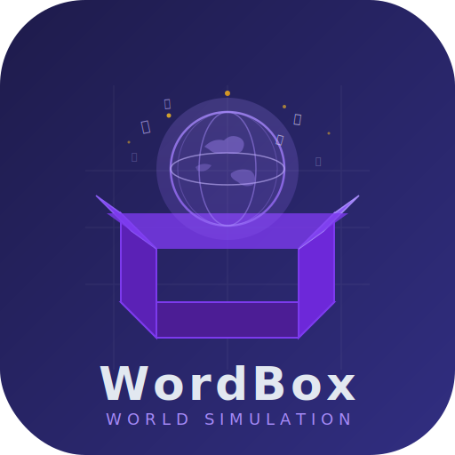

<p align="center">
  
</p>

<p align="center">
  <b>中文</b> | <a href="README-EN.md">English</a>
</p>

# WordBox

文本驱动的世界模拟器 — 用文字描述一个世界，观察它自行运转。

> **当前版本：V1.1.0** — 新增对战模式

## 简介

WordBox 是一个基于 LLM 的世界模拟引擎。你用自然语言描述一个世界的背景设定，WordBox 会生成角色、势力、地区，然后通过确定性数学引擎和 LLM 叙事生成相结合的方式，让这个世界自主运转。

作为观察者（上帝视角），你可以：
- 观察世界随时间推移发生的变化
- 向任何角色、势力或地区下达指令
- 查看结构化的事件日志和数据看板
- 缩放到具体的角色、对话和冲突
- **与好友实时对战，各扮演一方神明博弈**

## 核心特性

- **确定性模拟引擎** — 经济、稳定度、冲突等通过数学公式计算，保证可预测性
- **LLM 叙事生成** — 每个 tick 由 LLM 生成叙事文本，赋予世界生命力
- **神谕命令系统** — 向世界下达指令，支持多 tick 执行和叙事计划
- **数据看板** — 势力对比、角色状态、历史趋势的可视化图表
- **实体检查器** — 点击查看角色、势力、地区的详细信息
- **事件日志** — 结构化的世界事件记录
- **⚔️ 对战模式（新增）** — 双人实时对战，通过 WebSocket 连接，各控制一个势力进行博弈
- **🌫️ 战争迷雾** — 对战中双方共享世界数据，但隐藏对方的命令内容
- **🏆 胜负判定** — 势力崩溃、投降、领袖死亡等多条件自动判定胜负

## 技术栈

- Next.js 14 + TypeScript
- OpenAI 兼容 API
- WebSocket（ws）实时通信
- Recharts 数据可视化
- Tailwind CSS（暗色主题）

## 快速开始

```bash
# 安装依赖
pnpm install

# 配置环境变量
cp .env.example .env.local
# 编辑 .env.local 填入你的 API 密钥

# 启动开发服务器（单人模式）
pnpm dev

# 启动服务器（含 WebSocket 对战支持）
npm run dev:server
```

访问 `http://localhost:3000` 开始使用。

## 环境变量

| 变量 | 说明 | 默认值 |
|------|------|--------|
| `WORDBOX_API_BASE` | LLM API 地址 | `https://api.openai.com/v1` |
| `WORDBOX_API_KEY` | LLM API 密钥 | — |
| `WORDBOX_MODEL` | 使用的模型 | `gpt-4o-mini` |

## 项目结构

```
src/
  core/                领域模型（WorldSnapshot, SimAgent, SimCharacter...）
  core/sim/            模拟引擎（tick, math, formula-engine, coalition, battle, fog-of-war, victory...）
  services/llm/        LLM 调用层（story-agent, data-agent, formula-agent, battle-world-gen...）
  services/commands/   神谕命令系统
  services/battle/     对战房间管理（room-manager, tick-driver, ws-handler）
  services/persistence 服务端文件持久化
  ui/                  React UI 组件（console, dashboard, admin, battle）
app/
  sim/                 世界管理页面
  battle/              对战模式页面（大厅、对战面板、数据看板）
  api/sim/             API 路由
server.ts              自定义服务器（集成 WebSocket）
```

## 更新日志

### V1.1.0（2026-06-28）

**🎮 新增：对战模式**

- **双人实时对战** — 两个玩家各扮演一个势力的神明，在同一世界中用自然语言命令博弈
- **房间系统** — 创建房间 → 等待对手 → 自动生成对战世界 → 预览 → 抢选势力 → 开战
- **WebSocket 通信** — 通过自定义服务器实现低延迟双向通信
- **战争迷雾** — 双方共享世界数据，但隐藏对方的命令内容，增加策略深度
- **胜负判定** — 支持势力崩溃、投降、领袖死亡等多种胜负条件
- **对战 UI** — 全新的大厅、对战面板、数据看板和胜利画面

**🔧 改进**

- 经济系统常量重新平衡，修复势力经济衰退和角色财富为 0 的问题
- 修复 agent-character ID 不匹配导致关系为空的问题

### V1.0.0

- 初始版本发布
- 确定性模拟引擎 + LLM 叙事生成
- 神谕命令系统
- 数据看板与实体检查器

## 致谢

本项目灵感来源于 [SeedWorld](https://github.com/zmzhace/SeedWorld)，并稍作参考与学习。

## 许可证

MIT
